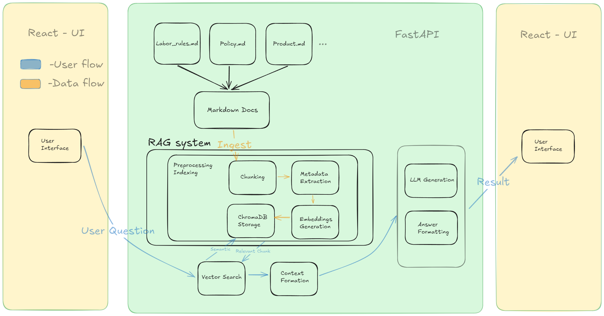
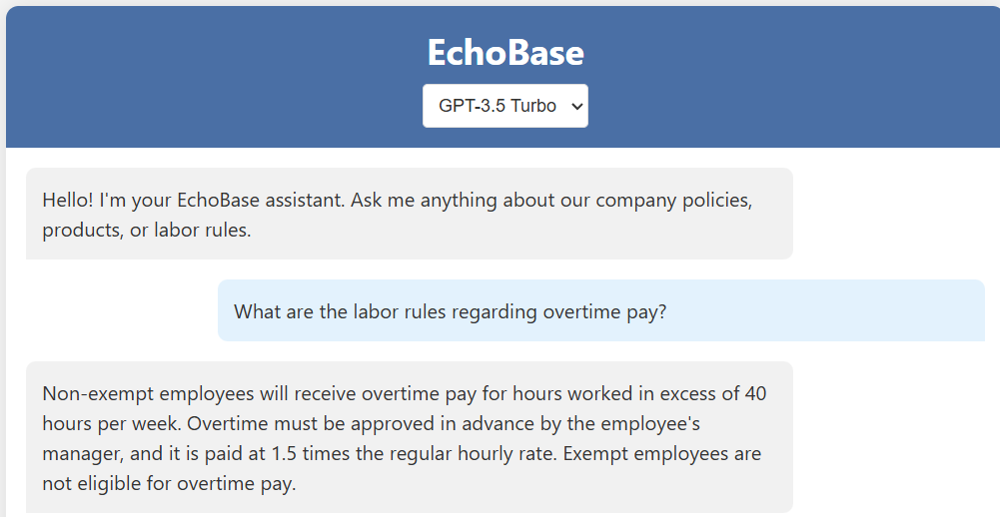
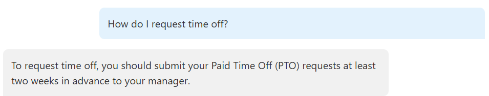
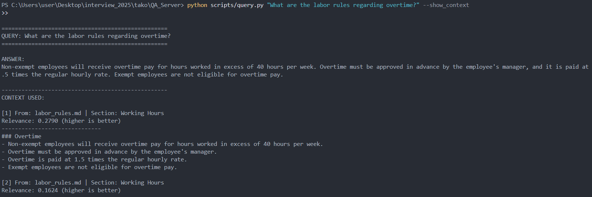

# EchoBase System Overview

## Problem Expansion & Assumptions

### Context

EchoBase addresses the challenge of efficiently accessing information from knowledge bases. Traditional keyword search methods often fail to capture semantic meaning, while manual document reading is time-consuming and inefficient. This RAG system bridges this gap by understanding the intent behind queries and retrieving contextually relevant information.

### Target Users

- **Support Teams**: Customer service representatives who need quick access to policies and procedures
- **Knowledge Workers**: Employees who regularly reference company documentation
- **Researchers**: Individuals analyzing large document collections
- **Technical Teams**: Engineers and developers referencing technical documentation
- **New Employees**: Staff during onboarding who need to quickly learn company policies

### Measurable Outcomes

- **Time Efficiency**: Reduction in time spent searching for information
- **Answer Accuracy**: Only answer with relevant question

## Data Requirements

### Data Collection

- **Document Types**: Primarily markdown files containing policies, manuals, procedures, and knowledge base content. Markdown files should be well-formatted with consistent headings, sections, and bullet structures to ensure accurate chunking and retrieval.
- **Metadata Extraction**: Automatic extraction of document titles, sections, and contents
- **Storage Requirements**: Vector embeddings require approximately 1KB per text chunk, with a typical document generating 10-50 chunks

### Privacy and Security

- **Data Processing**: All document processing occurs locally, with only embeddings sent to external APIs
- **Sensitive Information**: Confidential data, and security-related content should be redacted before ingestion

### Data Quality

- **Document Standards**: Consistent formatting, clear section headings, and concise writing improve retrieval quality

## Architecture Diagram

## Demo

The EchoBase system provides an intuitive chat interface where users can ask questions about company policies, procedures, and documentation. The system retrieves relevant information from the knowledge base and generates accurate, contextual answers.

[Screenshot will be placed here]

[What happens in BackEnd]

### Sample Interactions

**User**: "What are the labor rules regarding overtime pay?"

**EchoBase**: "Non-exempt employees will receive overtime pay for hours worked in excess of 40 hours per week. Overtime must be approved in advance by the employee's manager, and it is paid at 1.5 times the regular hourly rate. Exempt employees are not eligible for overtime pay."

**User**: "How do I request time off?"

**EchoBase**: "To request time off, you should submit your Paid Time Off (PTO) requests at least two weeks in advance."

## Future Improvements

### System Enhancements

- **Update Frequency**: System should ingest new or modified documents within 24 hours of changes
- **Version Control**: Tracking document versions to ensure answers reflect the most current information
- **Continuous Improvement**: Periodic review of low-confidence answers to identify knowledge gaps

### User Experience

- **Feedback Loop**: User feedback mechanism to flag incorrect or incomplete answers
- **User Feedback**: Implement thumbs up/down buttons for users to rate response quality

### Retrieval Optimization

- **Chunking Strategy**: Experiment with different chunk sizes and chunk overlap settings for various document types
- **Query Quality**: Evaluate retrieved chunks to improve the quality of context provided to the LLM
- **LLM Prompt Optimization**: Implement reranking for context with configurable relevance thresholds

### Edge Case Handling

- **Irrelevant Question Detection**: Record when the LLM identifies questions outside the knowledge domain for future analysis
